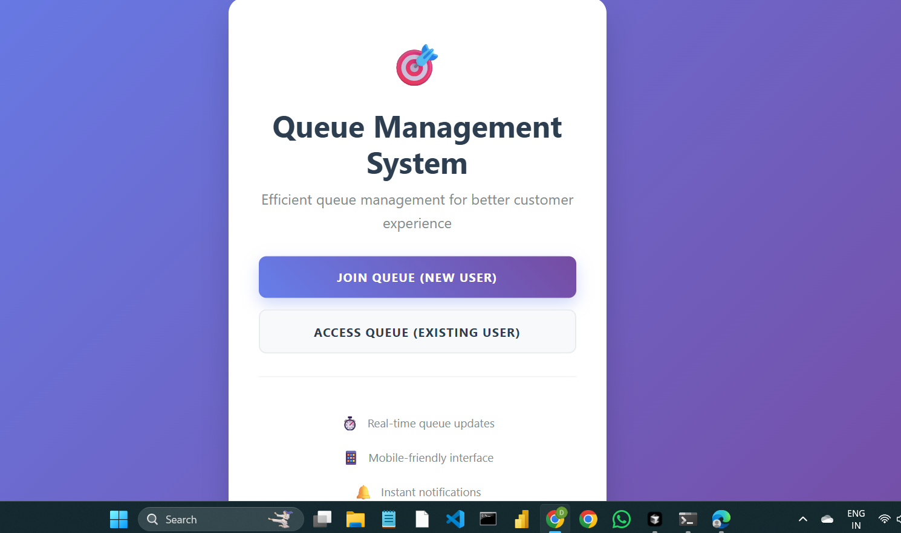
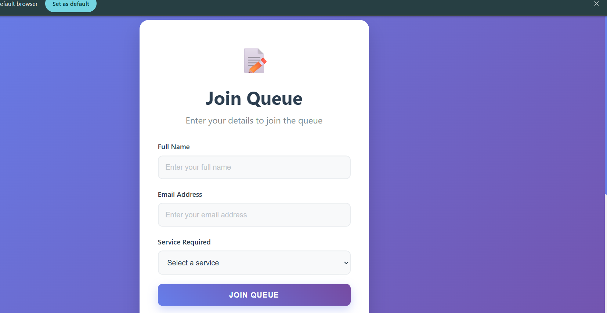
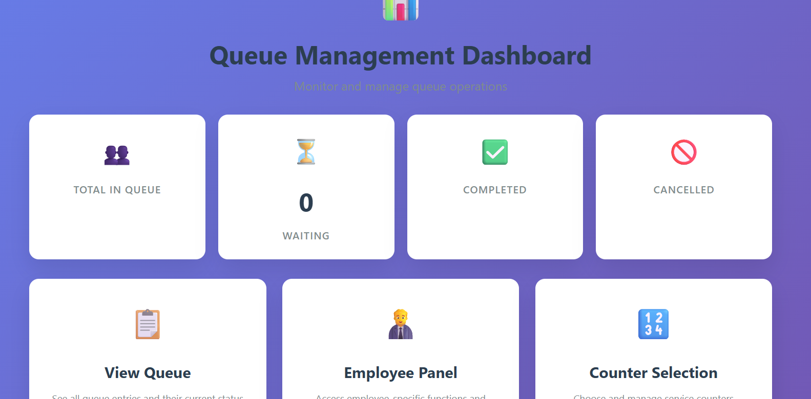

<div align="center">

# 🎯 Queue Management System (QMS)

**A modern, mobile-friendly Django web app for real-time queue management**

Built for retail stores, restaurants, banks, and any institution where customers wait in line — join a virtual queue, track your position live, and get notified when it's your turn.

[](https://www.python.org/)
[](https://www.djangoproject.com/)
[](LICENSE)
[](https://github.com/JAVVAJIDIVYA/Queue-Management-System/stargazers)

</div>

---

## 📌 Table of Contents

- [Demo Video](#-demo-video)
- [Screenshots](#-screenshots)
- [Features](#-features)
- [Technology Stack](#-technology-stack)
- [Quick Start](#-quick-start)
- [Email Configuration](#-email-configuration)
- [Usage](#-usage)
- [API Endpoints](#-api-endpoints)
- [Project Structure](#-project-structure)
- [Security Features](#-security-features)
- [Deployment](#-deployment)
- [Contributing](#-contributing)
- [License](#-license)

---

## 🎥 Demo Video

<div align="center">

[](https://www.linkedin.com/posts/javvaji-divya-2b1330340_smartqueue-innovation-django-ugcPost-7378069161442291712-0UeB)

*Click the badge above to watch a full walkthrough of the Queue Management System in action.*

</div>

---

## 📸 Screenshots

<table>
<tr>
<td align="center" width="33%">
<br/>
<b>🏠 Home Page</b><br/>
<sub>Entry point to join or access the queue</sub>
</td>
<td align="center" width="33%">
<br/>
<b>📝 Join Queue</b><br/>
<sub>Customer registration form</sub>
</td>
<td align="center" width="33%">
<br/>
<b>📊 Queue Dashboard</b><br/>
<sub>Live queue monitoring &amp; controls</sub>
</td>
</tr>
</table>

> 💡 Place these three images in a `screenshots/` folder at the root of the repo (already done below) so they render correctly on GitHub.

---

## ✨ Features

### 👤 Customer Features
- **Mobile-Optimized Interface** – Fully responsive design for smartphones and tablets
- **Email Verification** – Secure OTP-based registration
- **Token System** – Unique token numbers for easy identification
- **Live Countdown** – Real-time estimated wait time
- **Email Notifications** – Automatic alerts for position updates and turn
- **Availability Toggle** – Mark yourself available/unavailable in the queue
- **Auto-Refresh** – Automatic page updates with the latest queue info

### 👔 Employee Features
- **Employee Dashboard** – Clean, intuitive staff interface
- **Customer Management** – Serve, skip, or remove customers
- **Delay Management** – Add 5, 10, or 15-minute delays, or reset
- **Notifications** – Notify the next customers in line
- **Queue Overview** – View all customers and their availability
- **Real-Time Updates** – Live view of queue changes

### 🛠️ Admin Features
- **Django Admin Panel** – Full administrative control
- **User Management** – Manage customers and employees
- **Analytics** – Queue statistics and user data
- **System Configuration** – Configure queue-wide settings

---

## 🧰 Technology Stack

| Layer | Technologies |
|---|---|
| **Backend** | Django 5.2.5 · Python 3.13 · SQLite (dev) |
| **Frontend** | HTML5 · CSS3 · JavaScript · Mobile-first design |
| **Email** | Gmail SMTP |
| **Utilities** | python-dotenv, Django built-ins (auth, admin, email) |

---

## 🚀 Quick Start

### Prerequisites
- Python 3.8+
- pip (Python package installer)

### Installation

```bash
# 1. Clone the repository
git clone https://github.com/JAVVAJIDIVYA/Queue-Management-System.git
cd Queue-Management-System

# 2. Install dependencies
pip install -r requirements.txt

# 3. Set up environment variables
cp env_template.txt .env
# Edit .env with your email credentials

# 4. Run migrations
python manage.py migrate

# 5. Create a superuser
python manage.py createsuperuser

# 6. Start the server
python manage.py runserver 0.0.0.0:8000
```

### Access the App
| Device | URL |
|---|---|
| 🖥️ Desktop | `http://127.0.0.1:8000` |
| 📱 Mobile (same network) | `http://YOUR_IP_ADDRESS:8000` |

---

## 📧 Email Configuration

Set the following in your `.env` file:

```env
EMAIL_HOST=smtp.gmail.com
EMAIL_PORT=587
EMAIL_USE_TLS=True
EMAIL_HOST_USER=your_email@gmail.com
EMAIL_HOST_PASSWORD=your_app_password
DEFAULT_FROM_EMAIL=your_email@gmail.com
```

> ⚠️ **Note:** For Gmail, use an **App Password** instead of your regular account password.

---

## 📖 Usage

### For Customers
1. **Register** — Enter your name and email
2. **Verify** — Enter the OTP sent to your email
3. **Join Queue** — Receive your token number and position (see the [Join Queue](screenshots/join-queue.png) screen)
4. **Track Progress** — Watch your live countdown and position
5. **Get Notified** — Receive an email when it's your turn

### For Employees
1. **Login** with admin-created credentials
2. **Select a Counter** to operate
3. **Manage the Queue** — serve, skip, delay, or notify customers
4. **Monitor Status** via the live dashboard

### For Admins
1. Access the **Admin Panel** at `/admin/`
2. Manage employees and customers
3. Configure system-wide queue settings
4. Monitor activity and analytics

---

## 🔌 API Endpoints

| Endpoint | Description |
|---|---|
| `/` | Home page |
| `/register/` | Customer registration |
| `/otp/` | OTP verification |
| `/queue-details/` | View queue status |
| `/employee/` | Employee dashboard |
| `/admin/` | Django admin panel |
| `/toggle-availability/` | Mark availability |
| `/cancel-spot/` | Leave the queue |

---

## 🗂️ Project Structure

```
Queue-Management-System/
├── app1/                  # Core Django app
├── qms/                   # Project settings/config
├── staticfiles/admin/     # Collected static files
├── screenshots/           # README images
├── .gitignore
├── env_template.txt
├── manage.py
├── requirements.txt
├── CSS_README.md
├── EMPLOYEE_PANEL_README.md
└── README.md
```

### Database Models
- **QueueUser** – Customer information and queue position
- **Employee** – Staff members and counter assignments
- **QueueConfig** – Global queue settings
- **UserRequest** – Customer requests and messages

---

## 🔒 Security Features

- **CSRF Protection** – Cross-site request forgery prevention
- **Email Verification** – OTP-based registration
- **Session Management** – Secure user sessions
- **Input Validation** – Form validation and sanitization
- **Admin Authentication** – Secure admin access

---

## ☁️ Deployment

**Development**
```bash
python manage.py runserver 0.0.0.0:8000
```

**Production checklist**
- Use a production WSGI server (Gunicorn, uWSGI)
- Set up a reverse proxy (Nginx)
- Switch to a production database (PostgreSQL, MySQL)
- Configure proper static file serving
- Set up SSL certificates

---

## 👥 Contributing

Contributions are welcome!

1. Fork the repository
2. Create a feature branch: `git checkout -b feature/your-feature`
3. Make your changes
4. Run tests and ensure code quality (PEP 8, docstrings, clear commits)
5. Commit: `git commit -m 'Add some feature'`
6. Push: `git push origin feature/your-feature`
7. Open a pull request

---

## 📜 License

This project is licensed under the **MIT License** — see the [LICENSE](LICENSE) file for details.

## 🙏 Acknowledgments

- Built with [Django](https://www.djangoproject.com/)
- Inspired by real-world queue management needs
- Thanks to the Django community and all contributors

---

<div align="center">
Made with ❤️ using Django
</div>
